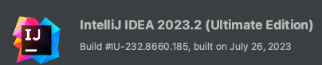

## Introduction

email address : didalgus@gmail.com  
repository : https://github.com/didalgus/springsecurity5.8_mybatis3  
blog address : https://didalgus.github.io/  

[board_springboot2.7_mysql](https://github.com/didalgus/board_springboot2.7_mysql) 에 Spring Security 를 적용하였습니다.   
회원 로그인, 게시판, 회원목록을 권한별(ROLE_ADMIN, ROLE_USER)로 확인 할 수 있습니다. 

API 목록은 [Swagger](http://localhost:8080/swagger-ui/index.html) 에서 확인할 수 있습니다. 

## Development Tools
- Apple MacBook M1 Pro 16GB (Ventura 13.5.1)
- IntelliJ IDEA 2023.1.2  

## Development Environment
- JAVA 17
- MySQL 5.7 
- Docker 23.0.5 (Docker Desktop 4.19.0)
- IntelliJ IDEA 2023.2 

## Application Version
- SpringBoot 2.7.13 (SpringFramework 5.3.27)
- Swagger3 (http://localhost:8080/swagger-ui/index.html)
- MyBatis 3.5.7
- SpringBoot Devtools 2.7.0
- [thymeleaf 3.0.15](https://www.thymeleaf.org/doc/articles/standardurlsyntax.html)

# Docker
맥용 Docker Desktop 설치가 필요합니다.  
https://docs.docker.com/desktop/install/mac-install/  

소스내 `docker` 디렉토리로 이동 후 아래 명령어로 compose 구동합니다.
```bash
docker-compose up -d 
```
* -d 옵션은 background 구동합니다.

compose 중지는 아래 명령로 실행합니다.
```bash
docker-compose down
```

docker-compose 설명   
개발환경이 MacBook M1 인경우 docker/docker-compose.yml 설정에 아래 옵션을 추가합니다.
```
platform: linux/amd64 
```

MySQL 컨테이너 접속 CLI 명령어  
```bash
docker exec -it mysql_5_7 bash
```
참고 Url https://github.com/docker-library/docs/tree/master/mysql  

MySQL 접속 명령어   
```bash
bash-4.2# mysql -udemo_user -pdem0Passw*rd demo_security  
```

## MySQL 

Docker 사용이 불가한 경우 MacOS에 MySQL Server 를 설치합니다. 
```bash
$ brew install mysql
```

버전을 확인합니다. 
```bash
$ mysql --version
mysql  Ver 8.0.33 for macos13.3 on arm64 (Homebrew)
```

서버를 구동합니다.
```bash
$ mysql.server start
Starting MySQL
. SUCCESS!
```
최초 설치 후 보안 설정을 합니다.
```bash
$ mysql_secure_installation
```

root 계정으로 로그인 후 데모계정을 생성하여 접속합니다.
```bash
$ mysql -u demo_user -h 127.0.0.1 -p'dem0Passw*rd' demo_security
```

서버를 종료합니다. 
```bash
$ mysql.server stop  
```

## Logs  
```bash
$ tail -f ~/logs/spring.log
```

## IntelliJ http 
IntelliJ IDEA 2023.2 버전 [Dynamic variables](https://www.jetbrains.com/help/idea/2023.2/exploring-http-syntax.html#dynamic-variables) 구문을 사용하였습니다.  

ex)
* $random.alphabetic(length): generates a sequence of uppercase and lowercase letters of length length (must be greater than 0). 
* $random.alphanumeric(length): generates a sequence of uppercase and lowercase letters, digits, and underscores of length length (must be greater than 0). 

http sample  
```
### 게시판 등록
POST /board/write HTTP/1.1
Host: localhost:8080
Content-Type: application/json

{
  "title" : "title{{$randomInt}}",
  "content" : "{{$random.alphanumeric(10)}}",
  "regType" : "User",
  "userId" : "name{{$random.alphabetic(3)}}"
}
```


## devtools
thymeleaf 사용하여 화면구성하였습니다. 
html 수정한 경우 브라우저만 새로고침하여 수정된 내용을 확인하기 위해 `spring-boot-devtools` 설정하였습니다. 

### build.gradle
build.gradle 에 `spring-boot-devtools` 의존성 추가합니다. 
```
dependencies {
    implementation 'org.springframework.boot:spring-boot-devtools'
    }
```
### application.properties
application.properties 파일에 thymeleaf 변경 내용이 바로 반영될 수 있도록 cache 를 끄는 옵션을 설정합니다. 
```
# thymeleaf (dev: false live: true)
spring.thymeleaf.cache=false
```

Develtools 에는 classpath 에 있는 파일의 수정을 감지하고 자동으로 재시작하는 기능이 있습니다.   
`Update class and resources` 로 설정하고 작업했더니 class 파일을 변경 할 때마다 재시작해서 `Update resources` 로 설정하였습니다.  
[IntelliJ Run/Debug Options](#intellij-run/debug-options) 설정 부분입니다. 

```
# devtools
spring.devtools.restart.enabled=false
```

### IntelliJ IDEA 



IntelliJ IDEA 2023.2 버전 기준입니다.   

#### IntelliJ Settings  
* Settings > Build, Execution, Deployment > Compiler > [v] Build project automatically
* Advanced Settings > [v] Allow auto-make to start even if developed application is currently running 

#### IntelliJ Run/Debug Options
* Run/Debug Configurations > Modify options > On 'Update' action: Update resources 
* Run/Debug Configurations > Modify options > On frame deactivation: Update resources 

## Bootstrap  
  
Bootstrap 3.4 로 화면 구성하였습니다.   
[https://getbootstrap.com/docs/3.4/components/](https://getbootstrap.com/docs/3.4/components/)  
[https://getbootstrap.com/docs/3.4/examples/theme/](https://getbootstrap.com/docs/3.4/examples/theme/)

